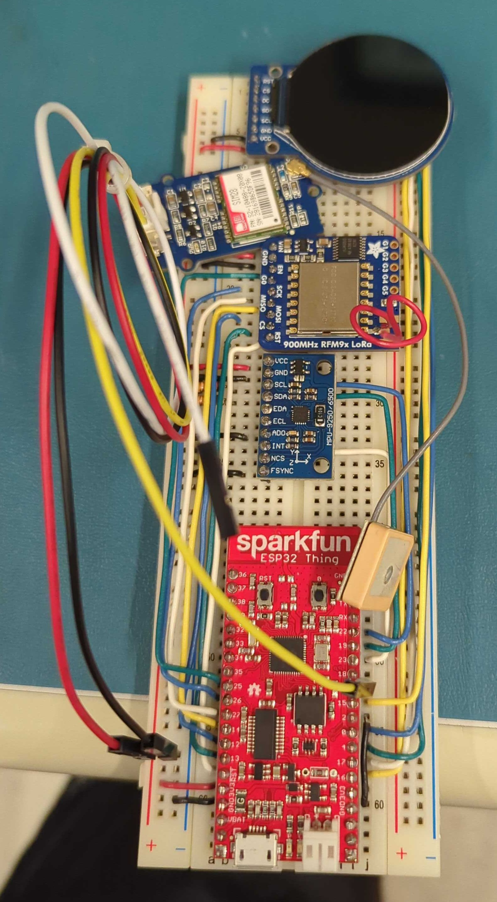
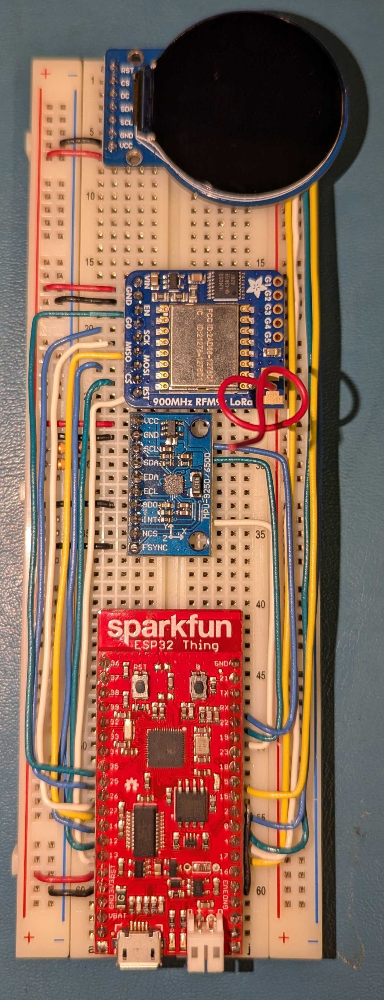

# Information
All artifacts can be found in [artifacts](artifacts)

All deliverables can be found in [deliverables](deliverables)

# Prototypes

### Current prototype without buttons


### Current prototype without buttons and gps (for a better visual)


# Getting started with development on a fresh machine

## Setup repo
```bash
# ssh
git clone git@github.com:sanchezocegueda/minimap.git
# http
git clone https://github.com/sanchezocegueda/minimap.git
cd minimap
git checkout prototype
git submodule update --init --recursive
```

## Setup IDF toolchain and VSCode extension
See [esp32-prototype/DEVELOPING.md](esp32-prototype/DEVELOPING.md)
