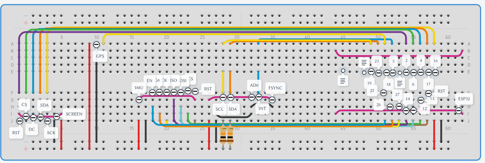
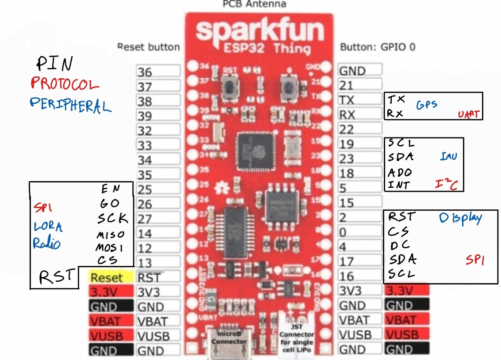
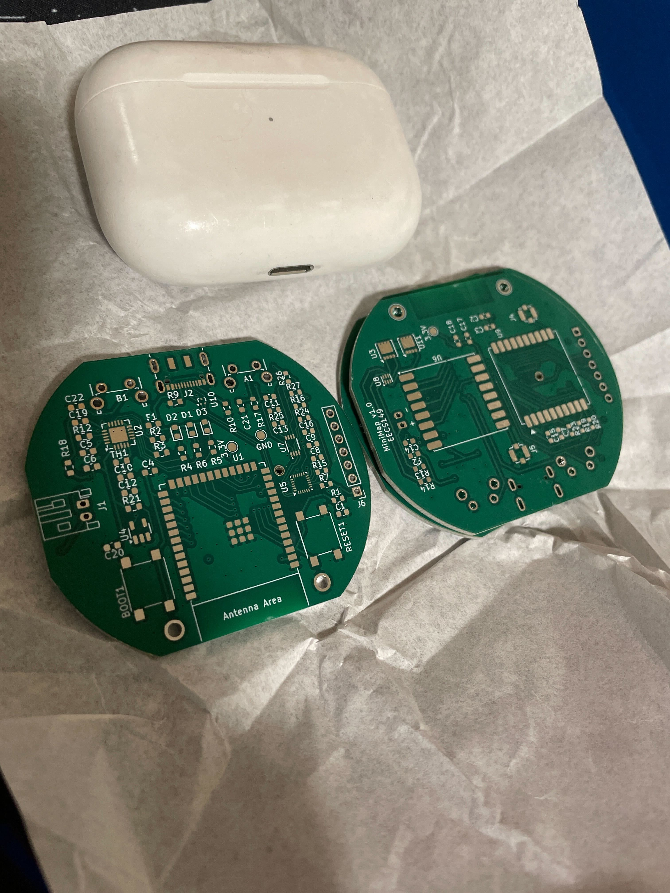

[peripheral_pins.md](peripheral_pins.md) is the most accurate description of our breadboard pinout for each device

[149_Project_Doc.pdf](149_Project_Doc.pdf) is a current reflection of our high level ideas and any calculations we've done.

### circuit schematic for the breadboard, it is a little out of date

### outdated visual of how we interface with each device

### pcb we built to hopefully have more than 2 devices
- This is a backburner task, but if time permits we hope to get atleast one more device assembled using this pcb.

